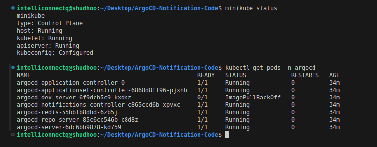

### What Are Argo CD Notifications?
Argo CD Notifications is an extension of Argo CD that allows users to receive notifications regarding the status and activities of Kubernetes applications managed by Argo CD. The tool alerts users about specific events, such as application deployment successes, failures, and other significant changes in application status.
Notifications can be delivered via various channels, including email, MS Teams, Slack, and webhook. This ensures that users receive critical information through their preferred communication platforms. The system is configurable, enabling control over what types of events trigger notifications and how those notifications are formatted and sent.

### How Do Argo CD Notifications Work? 
Argo CD Notifications integrate with the Argo CD application controller, which manages and monitors the state of applications:

1. The process begins with the Argo CD application controller, which continuously watches the repository for any changes or updates in the managed applications. 
2. When a change is detected, such as a code update or a deployment event, the application controller triggers an event. 
3. This event is then captured by the Argo CD Notifications controller. The notifications controller functions as a dedicated component that listens for these events. 
4. Once an event is captured, the controller processes it and determines whether it matches any predefined criteria for notifications. If it does, the controller forwards the event to the appropriate notification   services.
5. These notification services are configured to send messages to various platforms, such as Slack, email, or custom webhooks. For example, when using Slack as the notification platform, the event data is formatted and sent to a specified Slack channel via the Slack notifications service.

### To Get Started for the ArgoCD Notification Demo, Need a Kubernetes Cluster. It can be EKS, AKS, Minikube etc.
* I am using Minikube, which is Local Kubernetes Cluster. And Installed ArgoCD on the Cluster.

* Deploy 2 Applications inside ArgoCD.
1. web-app-1-a --> namespace: app-1
2. web-app-1-b --> namespace: app-1
3. web-app-2-a --> namespave: app-2

Create 2 namespaces named **app-1** & **app-2**. Deploy the above App to the respective namespace, create Application.yaml to deploy the application using **ArgoCD UI** OR **ArgoCD CLI**